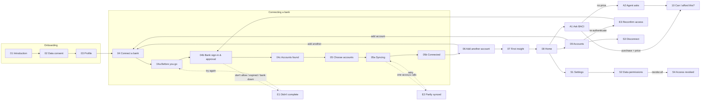

# BACI — End-to-end flow spec (design → build)

This is the build contract for the BACI app. It maps every artboard on the BACI Design canvas to a route, its API calls, the states it must handle, where each action goes, and how to check it's done.

- **Canvas:** the BACI Design artifact on claude.ai. Start with artboard **00 End-to-end flow map**, then press Play on **01 Introduction** to click through the whole journey.
- **Screen sources:** `docs/design/screens/*.dc.html` hold the artboard markup, and `docs/design/screens/canvas.json` holds the layout. They are reference material, not runtime code. Copy text and hierarchy from them, and take styling from the tokens in `src/styles/app.css`.
- **Product rules:** `docs/product/BACI_PRD.md` and `docs/product/BACI_FRD.md`, which the product owner supplied. When this spec and the FRD disagree about behaviour, the FRD wins. Record the conflict in the PR.
- **Design status:** these screens were derived from the PRD/FRD. They have **not** been reconciled with the Figma file. Once Figma variables are exported, swap the token values in `src/styles/app.css` and leave the components alone.

---

## 1. Journey at a glance

### Guards (enforced in `src/App.tsx` and on the server)

| Rule | Where |
|---|---|
| No step after 02 without consent (`PATCH /onboarding` returns 403) | server `app.ts` |
| Product routes (`/home`, `/chat`, `/accounts`, `/settings`) need `onboarding.step === 'done'`; anything else redirects to the current step | `App.tsx` |
| Every financial read and every agent tool checks consent on the server | `server/agent/tools.ts → executeTool` |
| Connecting a bank needs active consent | `ConnectionService.start` |

### Flow parameter

Screens 04–05b and E1 run in two contexts, chosen by `?flow=`:

| `flow` | Entered from | Picker path | "Done" / exit goes to |
|---|---|---|---|
| `onboarding` | 03 Profile, 06 Add another | `/onboarding/connect` | `/onboarding/accounts` |
| `accounts` | 09 Accounts › Add account | `/accounts/add` | `/accounts` |

---

## 2. Screen inventory

Status legend: ✅ built and matches the design · 🟡 built with a gap (see §5) · ⬜ not built

| ID | Artboard | Route | Component | Status |
|---|---|---|---|---|
| 00 | FlowMap | — | — | reference |
| 01 | Main | `/welcome` | `screens/Intro.tsx` | ✅ |
| 02 | Consent | `/onboarding/consent` | `screens/Consent.tsx` | ✅ |
| 03 | Profile | `/onboarding/profile` | `screens/Profile.tsx` | ✅ |
| 04 | Connect | `/onboarding/connect`, `/accounts/add` | `screens/InstitutionPicker.tsx` | ✅ |
| 04a | ConnectHandoff | `/connect/before/:institutionId` | `ConnectFlow.tsx › ConnectBeforeScreen` | ✅ |
| 04b | BankAuthorise | `/connect/authorise/:connectionId` | `ConnectFlow.tsx › AuthoriseScreen` | ✅ (sandbox stand-in) |
| 04c | Connecting | `/connect/:id/found` | `ConnectFlow.tsx › AccountsFoundScreen` | ✅ |
| 05 | SelectAccounts | `/connect/:id/select` | `ConnectFlow.tsx › SelectAccountsScreen` | ✅ |
| 05a | Syncing | `/connect/:id/sync` | `ConnectFlow.tsx › SyncScreen` | 🟡 |
| 05b | Connected | `/connect/:id/done` | `ConnectFlow.tsx › ConnectedScreen` | ✅ |
| E1 | ConnectFailed | `/connect/failed?reason=&institution=&name=&flow=[&reconnect=]` | `ConnectFlow.tsx › ConnectFailedScreen` | ✅ |
| E2 | SyncPartial | `/connect/:id/done` when `summary.partial` | `ConnectedScreen` (partial variant) | ✅ |
| E3 | Reconnect | `/accounts/reconnect/:connectionId` | `ConnectFlow.tsx › ReconnectScreen` | ✅ |
| 06 | AddAnother | `/onboarding/accounts` | `screens/AddAnother.tsx` | ✅ |
| 07 | FirstInsight | `/onboarding/insight` | `screens/FirstInsight.tsx` | 🟡 |
| 08 | Home | `/home` | `screens/Home.tsx` | ✅ |
| 09 | Accounts | `/accounts` | `screens/Accounts.tsx` | ✅ |
| 10 | Afford | `/chat` (affordability card) | `components/AffordabilityCard.tsx` | ✅ |
| A1 | ChatHome | `/chat` | `screens/Chat.tsx` | ✅ |
| A2 | AskClarify | `/chat` (clarify + tool-failure turns) | `server/agent/orchestrator.ts` | ✅ |
| S1 | Settings | `/settings` | `screens/Settings.tsx` | 🟡 |
| S2 | Permissions | `/settings/permissions` | `Settings.tsx › PermissionsScreen` | 🟡 |
| S3 | Disconnect | `/accounts` (dialog) | `Accounts.tsx › ConfirmDialog` | ✅ |
| S4 | Revoked | `/home` when API returns `consent_required` | `Home.tsx` | ✅ |

---

## 3. Screen specs

Each section lists the **purpose**, the **API** it calls, the **states** it must handle, the **actions** (where each goes) and the **done when** checks.

### 01 Introduction — `/welcome`
- **Purpose:** explain the agent, Secure Vault and Smart Alerts. Step 1 of 5.
- **API:** `PATCH /onboarding {step:'consent'}`.
- **States:** default · busy (button reads "Starting…") · error banner (network).
- **Actions:** Get started → 02.
- **Done when:** the "not regulated financial advice" footnote is visible, and the progress bar shows step 1 to screen readers.

### 02 Data consent — `/onboarding/consent`
- **API:** `PUT /consent {permissions}` (all 9 categories), then `PATCH /onboarding {step:'profile'}`.
- **States:** all on (the default) · some off · all off (submit disabled, with a warning) · transaction history off while others are on (warning explains what stops working) · saving · error.
- **Actions:** Back → 01 · Allow all / Turn all off · Agree and continue → 03.
- **Done when:** the switches use `role="switch"` with visible labels, and the server stores the consent version and timestamps.

### 03 Profile setup — `/onboarding/profile`
- **API:** `PUT /profile` (every field optional; stored as `DeclaredValue` with `source:'user_declared'` and `recordedAt`).
- **Fields:** annual take-home income · status · primary goal · risk approach · insight frequency · safety buffer (used by affordability).
- **States:** empty · invalid number (inline error with `aria-invalid`) · saving · error.
- **Actions:** Back → 02 · Continue → 04 · Skip for now → 04 (both call `PATCH /onboarding {step:'connect'}`).

### 04 Connect a bank — `/onboarding/connect`, `/accounts/add`
- **API:** `GET /institutions`, `GET /connections` (to show "N connections already").
- **States:** loading skeleton · list · search with no results · error with retry.
- **Actions:** pick a provider → 04a (`/connect/before/:institutionId?flow=`). **Nothing is created on the server yet.**

### 04a Before you go — `/connect/before/:institutionId`
- **Content:** what BACI will be able to see (account details, balances and up to 12 months of transactions, direct debits) · what BACI can never do (see the password, move money) · 90-day access · the regulated provider's name.
- **API:** `POST /connections {institutionId}` on Continue, which returns `authorisationUrl`.
- **Actions:** Continue to {bank} → 04b · Choose a different provider → 04.
- **Production:** `authorisationUrl` is the provider's hosted OAuth page. It opens in the same tab or a secure web view, and the redirect back lands on the callback that `authorise` stands in for.

### 04b Bank sign-in & approval — `/connect/authorise/:connectionId` (bank-hosted in production)
- **Purpose:** a stand-in for the bank's own pages. It deliberately uses the **bank's** colours (`institution.brandColour`), not BACI's, and has two steps: sign in, then approve.
- **API:** `POST /connections/:id/authorise {approved, sandbox?}`.
  - Success: `{discovered[], reauth}`. The discovered accounts are cached in `sessionStorage` under `baci:discovered:{id}`.
  - Failure: `error.details = {reason, institutionId, institutionName, reauth}`.
- **Routing after the call:**
  - success + `reauth:false` → 04c
  - success + `reauth:true` → 05a
  - failure → E1 with `?reason=`, plus `&reconnect=:id` if it was a re-authorisation.
- **Server rule:** when a **new** connection fails, the server deletes it. Nothing is shared and no dead entry is left behind. When a **re-authorisation** fails, the connection stays in `reauth_required`.
- **Dev only:** a "Sandbox outcomes" panel offers one account failing, the link expiring, and the bank not responding. The `sandbox` field is ignored when `NODE_ENV=production`.

### 04c Accounts found — `/connect/:id/found`
- **Content:** progress list (access approved ✓ · secure connection ✓ · found N accounts ✓ · choose accounts: next).
- **States:** N > 0 · N = 0 (warning, with the action "Choose a different provider").
- **Actions:** Review N accounts → 05.

### 05 Choose accounts — `/connect/:id/select`
- **API:** `POST /connections/:id/accounts {accountIds}`.
- **States:** all ticked (the default) · some ticked · none ticked (button reads "Select at least one account" and is disabled) · duplicate account (disabled, "already connected via {institution}") · discovery cache missing (warning plus "start again").
- **Actions:** Use N accounts → 05a.

### 05a Syncing — `/connect/:id/sync`
- **API:** `POST /connections/:id/sync`. The server normalises and categorises transactions, finds regular payments, rebuilds the snapshot and regenerates insights.
- **States:** running (progress bar with `role="progressbar"` plus 5 labelled steps) · done (live-region announcement, then auto-advance to 05b) · error (`reauth_required` → E3; anything else → Retry sync, or Continue without it).
- **Gap:** see §5.1.

### 05b Bank connected / E2 Partly synced — `/connect/:id/done`
- **API:** `GET /connections/:id/summary` returns `{accounts, transactionCount, regularPayments, historyDays, suggestions[], partial}`.
- **Connected:** the accounts with balances (debts labelled "owed" and "not counted as cash") · stats · a nudge built from `suggestions` (money going to savings, a card or a loan the user hasn't connected).
  - Actions: Connect another bank → 04 · Done → exit path.
- **Partly synced (`partial:true`):** failed accounts show "Sync failed" and "balance unavailable" (no stale figure), plus a warning that answers exclude them.
  - Actions: Retry now → 05a · Continue with N accounts → exit path.

### E1 Connection didn't complete — `/connect/failed`
- **Reasons:**
  - `cancelled`: "{Bank} wasn't connected" / Try again
  - `timed_out`: "The link to {Bank} expired" / Start again
  - `bank_unavailable`: "{Bank} isn't responding" / Retry
- **Content:** the title sits in `role="alert"` · Provider / What happened / Your data ("Nothing was shared with BACI.").
- **Actions:** retry → 04a (or → E3 if `reconnect` is set) · Choose a different provider → 04 (hidden on reconnect) · Skip for now → exit path.

### E3 Reconfirm access — `/accounts/reconnect/:connectionId`
- **Content:** the bank tile in the bank's colour · status badge · affected accounts · last successful sync · the consequence ("left out of answers — BACI won't show an estimate").
- **API:** `POST /connections/:id/reauthorise` → 04b. Disconnect uses `DELETE /connections/:id` after a confirmation dialog.
- **Actions:** Continue to {bank} → 04b · Not now → 09 · Disconnect {bank} instead → confirm → 09.

### 06 Add another account — `/onboarding/accounts`
- **API:** `GET /connections`.
- **States:** nothing connected (only "Connect an account") · N connected, with the statuses listed · a coverage note when no savings or card is connected.
- **Actions:** Add another account → 04 · Continue with N accounts → `PATCH /onboarding {step:'first_insight'}` → 07.

### 07 First insight — `/onboarding/insight`
- **API:** `GET /insights`, `GET /connections`, `GET /snapshot`. Finishing calls `PATCH /onboarding {step:'done'}`.
- **Insight card must show:** title · summary · impact amount and period · the accounts it's based on · the data period · confidence · freshness · evidence count · an action.
- **States:** an insight exists · no insight ("Nothing urgent to flag") · loading ("Analysing your accounts") · error.
- **Actions:** Explore my finances → 08 · Ask BACI about this → A1 with `?q=Tell me more about: {title}` · Review subscriptions → A1.
- **Gap:** see §5.2.

### 08 Home — `/home`
- **API:** `GET /snapshot`, `GET /insights`, `GET /connections`, `GET /commitments?days=30` (403 treated as "not shared"), `GET /goals`, `POST /insights/:id/dismiss`.
- **Content:** a coverage line or banner · available cash in current accounts · a 4-stat grid (savings, cards owed, loans owed, bills in the next 30 days, each "Not shared" when consent is off) · "Can I afford this?" entry · insights · coming up · goal · accounts summary.
- **States:** healthy · stale (warning banner) · failed account (alert banner) · no accounts (connect CTA) · revoked consent (S4) · loading · error.
- **Nav:** Home · Ask BACI (A1) · Accounts (09) · Settings (S1). Bottom tabs below 900px, side rail from 900px up.

### 09 Accounts — `/accounts`
- **API:** `GET /connections`, `PATCH /accounts/:id {selected}`, `POST /connections/:id/sync`, `DELETE /connections/:id`.
- **Per connection:** name · last successful sync · a status badge (text plus icon) · a problem banner (stale, re-auth or error, naming the affected accounts and the last good sync) · account rows with an include/exclude switch.
- **Actions:** Refresh / Retry · Re-authenticate → E3 · Continue authorisation (for an abandoned `awaiting_authorisation`) · Disconnect → S3 · Add account → 04 (`flow=accounts`).
- **Dev only:** a Simulate select (stale, re-auth, provider error, restore).

### 10 Can I afford this? — `/chat` affordability card
The figures come **only** from `calculatePurchaseImpact`. The card lays out:
1. Verdict header (affordable / tight / not recommended / not enough data)
2. Short answer
3. Why
4. Financial impact: before, purchase, right after, bills, lowest point, above buffer, goal delay, card use
5. A bar chart with a text alternative
6. Risk flags
7. Options ("options, not advice")
8. Assumptions and data coverage
9. Follow-up chips ("What if I wait until payday?" / "What about £X?")

### A1 Ask BACI — `/chat`
- **API:** `POST /agent/conversations`, `POST /agent/conversations/:id/messages {text}`.
- **Content:** the welcome turn with quick replies · a log with `role="log"` and `aria-live="polite"` · agent blocks (snapshot, commitments, accounts, coverage notices, affordability) · a composer (Enter sends, Shift+Enter adds a new line).
- **`?q=`:** sends that message once on load, then clears the parameter.
- **States:** thinking ("Checking your accounts…") · send error (restore the text and show a banner) · coverage notices (stale, failed, savings not shared).

### A2 Agent asks / won't guess — `/chat`
- **Missing price:** "How much does the {item} cost?" No tool call is made until the user gives a price.
- **Finance without a term:** ask for the months and APR. If the user isn't sure, show 0% and flag it clearly.
- **Tool failure:** "I couldn't retrieve your live financial data just now, so I won't guess at the numbers." Add a "Try again" quick reply and style the bubble as an error.

### S1 Settings — `/settings`
- **Content:** a link to S2 · a link to Accounts · the financial profile (editable) · the advice disclaimer.
- **Gap:** see §5.3.

### S2 Data permissions — `/settings/permissions`
- **API:** `PUT /consent`, `DELETE /consent` (confirmation dialog).
- **Content:** version, first-agreed date and last-updated time · the 9 switches · Save · Revoke all access.
- **Gap:** see §5.4.

### S3 Disconnect — dialog on `/accounts` and E3
- Lists the accounts that will be removed · explains that the transaction copy is deleted, other accounts stay and insights are recalculated.
- **API:** `DELETE /connections/:id`. The server deletes the token from the vault, purges those transactions, recalculates insights and writes an audit entry.

### S4 Access revoked — `/home` (and any read) after `DELETE /consent`
- Reads return `403 consent_required`. Home shows the empty state with Review permissions → S2 and Manage connected accounts → 09. The agent replies that it needs permission.

---

## 4. Design tokens (current values)

Defined in `src/styles/app.css :root`. Components must use the tokens, never hex values.

| Token | Value | Use |
|---|---|---|
| `--ground` | `#F5F3EE` | page background |
| `--surface` / `--surface-2` | `#FFFFFF` / `#EFECE5` | cards / segmented controls |
| `--ink` / `--ink-2` / `--muted` | `#16181D` / `#454A54` / `#5B606B` | text |
| `--line` / `--line-strong` | `#E1DDD3` / `#C9C4B8` | borders |
| `--primary` / `--primary-soft` | `#0F5C4C` / `#E3EFE9` | actions, brand |
| `--ok` `--warn` `--danger` `--info` (+ `-soft`) | `#1D6B45` `#8A5100` `#B42318` `#2F4B7C` | status (always paired with text and an icon) |
| `--font-display` | Fraunces 600 | headings, big figures |
| `--font-body` | Instrument Sans 400–700 | everything else |
| radius | 10 / 16 / 24 | inputs / cards / dialogs |
| touch target | ≥ 44px | all controls |

The bank screen (04b) uses `--bank` (the institution's brand colour) on purpose, so it reads as someone else's page.

---

## 5. Known gaps to implement next (in this order)

1. **05a background sync.** The design lets the user carry on while sync finishes. Make sync asynchronous (`202` plus polling, or SSE), keep 05a as the progress view, and add a link: "Taking a while? You can carry on — we'll finish in the background."
2. **07 Dismiss.** Add a Dismiss button to the first-insight card that calls `POST /insights/:id/dismiss`. It stays on the screen and falls back to the "Nothing urgent" state.
3. **S1 declared vs detected income.** Show "£X a year (you said)" alongside "£Y/month detected" from `snapshot.monthlyIncome`. Never overwrite one with the other (FRD FR-002).
4. **S2 impact hint.** When a switch differs from the saved value, show an explanation of what changes (for example, "Savings & ISAs off means savings aren't counted in 'Can I afford this?'").
5. **Real Open Banking adapter.** Implement `BankingProvider` for the chosen aggregator: hosted OAuth for 04a→04b, a callback route that replaces `POST /authorise`, and webhooks that set `stale` and `reauth_required`.
6. **Persistence.** Replace the in-memory `Store` with Postgres, and replace `TokenVault` with a KMS-backed store.
7. **Auth.** Replace the dev cookie session with the identity provider.

---

## 6. Acceptance walk-through (manual + e2e)

Run `npm run dev`, open `http://localhost:5173` at 390×844, then:

1. 01 → 02 (switch one category off, then back on) → 03 (Skip) → 04.
2. Lumen Card → 04a → 04b → **Cancel** → E1 "wasn't connected" → Choose a different provider. `GET /connections` is still empty.
3. Harbour Bank → 04a → 04b Sign in → Approve → 04c "Found 2" → 05 (untick the loan; the button reads "Use 1 account") → 05a → 05b shows the nudge "a loan you haven't connected" → Done → 06.
4. Add another → Northgate → Sandbox: **one account fails** → 05b partial (E2) → Continue with 1 account.
5. 06 Continue → 07 insight → Explore → 08 shows the "Sync failed" coverage alert.
6. A1: "Can I buy this sofa on finance?" → A2 asks the price → "£1,400" → asks the term → "24 months at 9.9%" → 10 card with the monthly cost.
7. 09: Simulate re-auth on a bank → Re-authenticate → E3 → Continue → 04b in **that bank's** colours → approve → 05a → 05b.
8. 09: Disconnect Harbour → S3 confirm → the duplicate-subscription insight is gone and Home totals drop.
9. S1 → S2 → Revoke all → S4 on Home. A1 replies that it needs permission.
10. Keyboard only: tab through steps 1–3 with visible focus. VoiceOver/NVDA announce the sync result and E1 alerts.

Automated coverage: `npm test` (96 tests). `e2e/journey.mjs` automates steps 1–7 against a running dev server (`npm i -D playwright` then `node e2e/journey.mjs`).
